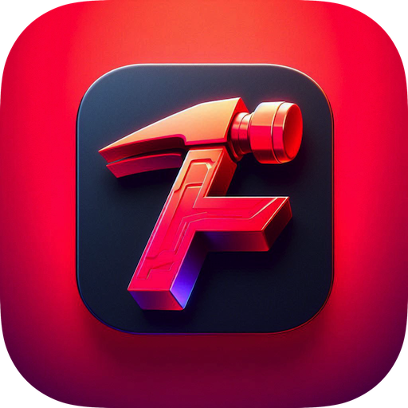

# FazeKit

[](http://cocoapods.org/pods/FazeKit)
[](http://cocoapods.org/pods/FazeKit)
[](http://cocoapods.org/pods/FazeKit)
[](https://developer.apple.com/swift)

{ width=180px }

A collection of extensions and convenience functions on Foundation, UIKit and other Cocoa Frameworks, built in Swift for iOS development. The spiritual successor to [NFAllocInit](https://github.com/NextFaze/NFAllocInit).

Included are little things, like shorthand mutation of views:

```swift
view.left = 40.0
```

device accessors:

```
UIDevice.is4Inch()
```

and operator overloads for `NSDate`:

```swift
if oneDate < anotherDate {
    print("one date is earlier")
}
```

## Example

To run the example project, clone the repo, and run `pod install` from the Example directory first.

## Requirements

iOS 14.0

## Installation

### Swift Package Manager

Add FazeKit to your project via Xcode:

1. File > Add Package Dependencies...
2. Enter the repository URL: `https://github.com/NextFaze/FazeKit.git`

Or add it to your `Package.swift`:

```swift
dependencies: [
    .package(url: "https://github.com/NextFaze/FazeKit.git", from: "3.0.0")
]
```

### CocoaPods

FazeKit is also available through [CocoaPods](http://cocoapods.org). Add the following line to your Podfile:

```ruby
pod "FazeKit"
```

## License

FazeKit is available under the APACHE 2.0 license. See the LICENSE file for more info.
